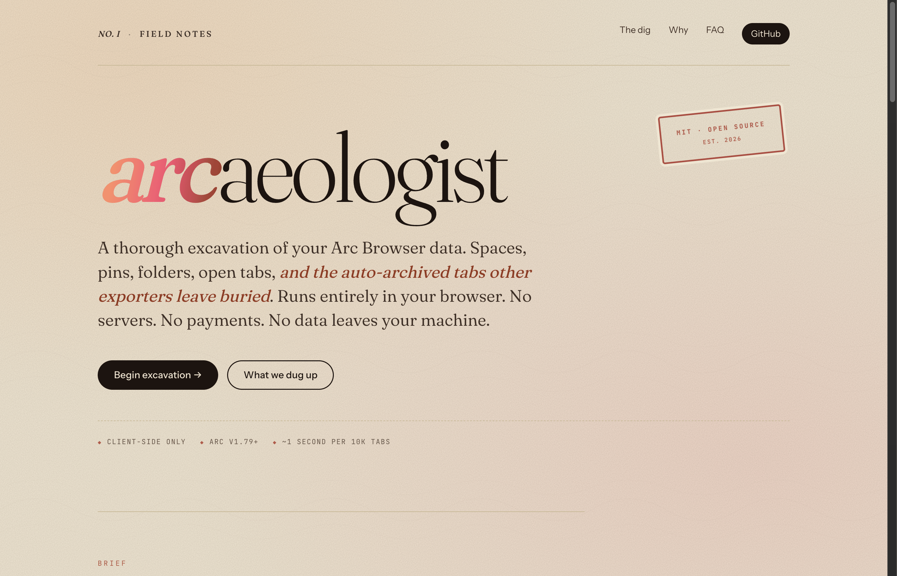

<p align="center">
  
</p>

<p align="center">
  <a href="./LICENSE"></a>
  
  
  
  
  <a href="https://github.com/sponsors/plainspace"></a>
</p>

<h1 align="center">arcaeologist</h1>

<p align="center">
  <strong>A thorough excavation of your Arc Browser data.</strong><br>
  Spaces, pinned tabs, nested folders, open tabs, per-profile favorites,<br>
  <em>and the auto-archived tabs that other exporters leave buried.</em>
</p>

<p align="center">
  <a href="https://plainspace.github.io/arcaeologist"><strong>▸ Live tool</strong></a> &nbsp;·&nbsp;
  <a href="#usage">Usage</a> &nbsp;·&nbsp;
  <a href="#feature-comparison">vs other exporters</a> &nbsp;·&nbsp;
  <a href="https://github.com/sponsors/plainspace">Sponsor</a>
</p>

<br>

---

## Why this exists

Arc quietly auto-archives most of the tabs you've ever opened. Pinned tabs get remembered. Folders get saved. But the tabs that age out of your sidebar after a day, a week, or a month... those are where years of research live. Recipe links. Half-read articles. Job postings from 2023. The essay you meant to read.

Every other Arc exporter I tried skips that archive entirely. [ArcEscape.com](https://arcescape.com) (freemium, $5 unlimited) and [`xiaogliu/export-arc-bookmarks`](https://github.com/xiaogliu/export-arc-bookmarks) (free, MIT) both walk right past it. For a lot of Arc users, that's the most valuable thing in the browser... the second brain.

`arcaeologist` reads both the sidebar and the archive, filters the noise (keeping only tabs Arc auto-archived on timer, dropping ones you deliberately closed), groups them by the month they got buried, deduplicates by URL, and gives you a standard HTML bookmarks file.

Use it to back up. Use it to switch browsers. Use it to keep an offline snapshot. Entirely your call.

## Feature comparison

| | arcaeologist | ArcEscape | export-arc-bookmarks |
|---|---|---|---|
| Pinned tabs & nested folders | ✓ | ✓ | partial |
| **Auto-archived tabs** | **✓ with month folders** | — | — |
| Open (unpinned) tabs | ✓ per space | partial | — |
| Per-profile favorites | ✓ | mixed | mixed |
| One file per space | ✓ + combined zip | — | — |
| Chrome/Safari import works | ✓ | ✓ | first space only |
| Price | free · MIT | $5 unlimited | free · MIT |

## Usage

1. **Get your Arc data files.** Locations by platform:

   | Platform | Path |
   |---|---|
   | **macOS** (tested) | `~/Library/Application Support/Arc/` |
   | **Windows** (likely, untested) | `%LOCALAPPDATA%\Arc\User Data\` |

   You need `StorableSidebar.json` (required) and `StorableArchiveItems.json` (optional but recommended — this is where your auto-archived tabs live).

   On macOS: in Finder, press ⌘⇧G and paste the path.
   On Windows: paste the path into File Explorer's address bar.

   If your Windows install is elsewhere (Microsoft Store version, for example), [open an issue](https://github.com/plainspace/arcaeologist/issues/new) with the correct path and I'll update the docs.

2. **Open the tool.** Either use [the live version](https://plainspace.github.io/arcaeologist) or clone this repo and open `index.html` directly.

3. **Drop both JSON files** into the excavation tray. Review the preview stats.

4. **Download.** Two options:
   - **Combined** — one `arc-bookmarks.html` with every space nested inside.
   - **Everything (zip)** — the combined file + one `arc-<SpaceName>.html` per space.

5. **Import into your new browser:**
   - **Chrome / Brave / Edge / Vivaldi / DuckDuckGo:** Settings → Bookmarks → Import bookmarks and settings → HTML file
   - **Firefox / Zen:** Bookmarks → Manage bookmarks → Import and Backup → Import Bookmarks from HTML
   - **Safari:** File → Import From → Bookmarks HTML File

## Output structure

```text
Arc Export/
├── 😎 Personal/
│   ├── Favorites/                (per-profile top-row favorites)
│   ├── (pinned tabs + folders, full Arc hierarchy preserved)
│   ├── Open tabs/                (unpinned live tabs)
│   └── Archived/                 (auto-archived, month-grouped, deduped)
│       ├── 2026-04/
│       ├── 2026-03/
│       └── ...
├── 🚧 Work/
│   └── ...
└── ...
```

Arc stores favorites per *Chrome profile*, not per space. Spaces sharing a profile will share the same `Favorites/` contents — that's faithful to how Arc actually behaves.

## Design notes

- **Auto-archive only.** Arc records two kinds of archive events: `"auto"` (timer expired) and `"manual"` (you closed the tab deliberately). Only `"auto"` is exported — the others are noise you already decided against.
- **Dedup.** Archived tabs often repeat URLs across days. Kept: the most recent archive per URL per space.
- **Open-vs-pinned dedup.** If a URL is pinned, it's dropped from `Open tabs/`.

## Files

```text
arcaeologist/
├── index.html          # UI shell + landing page
├── src/
│   ├── parser.js       # StorableSidebar.json + StorableArchiveItems.json → tree
│   ├── exporter.js     # tree → Netscape bookmarks HTML (combined or per-space)
│   ├── zip.js          # minimal STORE-method ZIP writer, no dependencies
│   ├── app.js          # UI wiring + FileReader pipeline
│   └── style.css       # Field Notes aesthetic
├── tests/
│   └── smoke.cjs       # node tests/smoke.cjs <sidebar> [<archive>]
├── LICENSE
└── README.md
```

Zero build step. Zero npm dependencies. Open `index.html`, done.

## Smoke test

```sh
node tests/smoke.cjs \
  ~/Library/Application\ Support/Arc/StorableSidebar.json \
  ~/Library/Application\ Support/Arc/StorableArchiveItems.json
```

Prints per-space tab counts, folder counts, and output byte size.

## Privacy

Nothing leaves your machine. The page is a static HTML file. Your JSON is read via `FileReader`, parsed in memory, written to a Blob, and thrown away when you close the tab. No backend, no analytics, no telemetry, no tracking pixel, no third-party fetch. Verify in your DevTools Network tab.

Fonts load from Google Fonts on first visit (cached thereafter). If you need fully-offline, self-host the fonts or strip the font link from `index.html`.

## Support this project

Free and MIT forever. If it saved you hours, [sponsor on GitHub](https://github.com/sponsors/plainspace) — recurring or one-time, 0% fees.

Or just star the repo and send it to a fellow Arc refugee.

## Contributing

Issues and PRs welcome. Especially:
- Edge cases in Arc's on-disk format (share a redacted fixture if your file breaks the parser)
- Windows/Linux Arc file paths
- Additional output formats (JSON, OPML, Markdown)

## License

[MIT](./LICENSE) © 2026 Jared Volpe
